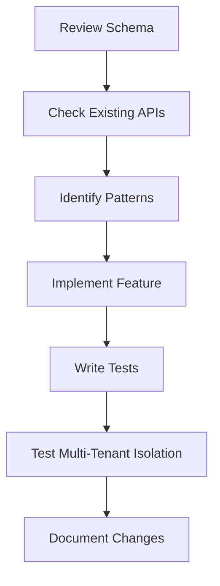

# ClinMetrics Pro - Developer Reference Guide

> **Quick Start**: Streamlined developer reference with links to detailed documentation
> **Last Updated**: 2025-10-17
> **Version**: 2.0.0

---

## 📚 Documentation Structure

This reference guide has been split into focused modules for better performance and maintainability:

### Core References

- **[Database Schema Reference](./reference/schema.md)** - Complete database models, fields, and relationships
- **[API Endpoints Reference](./reference/api.md)** - RESTful API documentation with request/response examples
- **[Services & Controllers](./reference/services.md)** - Backend service layer and controller functions
- **[Code Patterns & Best Practices](./reference/patterns.md)** - Common patterns, validation, error handling

### Quick References

- **[Enums & Constants](./reference/enums.md)** - All enum values and constants used in the system
- **[Utility Scripts](./reference/scripts.md)** - Development and maintenance scripts documentation
- **[Troubleshooting Guide](./reference/troubleshooting.md)** - Common errors and solutions

---

## 🚀 Quick Start

### Essential Models (Most Frequently Used)

| Model | Primary Use | Key Fields | Reference |
|-------|-------------|-----------|-----------|
| **User** | Authentication | `email`, `passwordHash`, `mfaEnabled` | [Schema](./reference/schema.md#user) |
| **Organization** | Multi-tenancy | `name`, `type`, `settings` | [Schema](./reference/schema.md#organization) |
| **Patient** | Patient records | `firstName`, `lastName`, `dateOfBirth` | [Schema](./reference/schema.md#patient) |
| **Clinician** | Clinical staff | `firstName`, `lastName`, `npiNumber` | [Schema](./reference/schema.md#clinician) |
| **Alert** | Clinical alerts | `severity`, `status`, `riskScore` | [Schema](./reference/schema.md#alert) |
| **Enrollment** | Program enrollment | `billingProgramId`, `billingEligibility` | [Schema](./reference/schema.md#enrollment) |
| **TimeLog** | Time tracking | `clinicianId`, `enrollmentId`, `duration` | [Schema](./reference/schema.md#timelog) |
| **Observation** | Clinical data | `patientId`, `enrollmentId`, `value` | [Schema](./reference/schema.md#observation) |

### Common API Endpoints

| Endpoint | Method | Purpose | Documentation |
|----------|--------|---------|---------------|
| `/api/auth/login` | POST | User authentication | [API](./reference/api.md#authentication-endpoints) |
| `/api/patients` | GET | List patients | [API](./reference/api.md#patient-endpoints) |
| `/api/alerts` | GET | List alerts | [API](./reference/api.md#alert-endpoints) |
| `/api/alerts/:id/resolve` | POST | Resolve alert | [API](./reference/api.md#alert-endpoints) |
| `/api/billing/summary/:orgId/:month` | GET | Billing summary | [API](./reference/api.md#billing-endpoints) |

### Critical Code Patterns

```javascript
// ✅ ALWAYS filter by organizationId for multi-tenant isolation
const patients = await prisma.patient.findMany({
  where: {
    organizationId: req.user.currentOrganization, // REQUIRED!
    isActive: true
  }
});

// ✅ Use Clinician ID, NOT User ID for TimeLogs
const timeLog = await prisma.timeLog.create({
  data: {
    patientId,
    clinicianId: clinician.id, // Must be Clinician ID
    enrollmentId,              // Link to billing enrollment
    duration: 15
  }
});
```

**[See all code patterns →](./reference/patterns.md)**

---

## 📖 Project-Specific Guidelines

### Before Writing Any Code

**IMPORTANT**: Always consult this reference guide before implementing features:

1. **Check [Database Schema](./reference/schema.md)** - Verify model fields and relationships
2. **Review [API Endpoints](./reference/api.md)** - Use existing endpoints when available
3. **Follow [Code Patterns](./reference/patterns.md)** - Ensure multi-tenant isolation and proper ID usage
4. **Reference [Services](./reference/services.md)** - Use existing service functions

### Key Architectural Principles

- **Multi-Tenant Isolation**: ALWAYS filter by `organizationId`
- **enrollmentId Linkage**: TimeLogs and Observations MUST link to enrollments for billing accuracy
- **User vs Clinician IDs**: Use correct ID type for each relationship
- **Prisma Transactions**: Use for multi-step operations
- **Billing Configuration**: All billing criteria stored in database (not hardcoded)

---

## 🔍 Finding What You Need

### By Task Type

**Building a new feature?**
1. Check [Database Schema](./reference/schema.md) for required models
2. Review [API Endpoints](./reference/api.md) for similar patterns
3. Follow [Code Patterns](./reference/patterns.md) for implementation
4. Use [Services](./reference/services.md) for business logic

**Debugging an issue?**
1. Check [Troubleshooting Guide](./reference/troubleshooting.md) for common errors
2. Review [Enums](./reference/enums.md) for valid values
3. Verify organization isolation with [Code Patterns](./reference/patterns.md)

**Setting up test data?**
1. See [Utility Scripts](./reference/scripts.md) for seed scripts
2. Use billing test data scripts for CMS billing scenarios

**Understanding billing?**
1. Review [Enrollment schema](./reference/schema.md#enrollment) for billing linkage
2. Check [Billing API](./reference/api.md#billing-endpoints) for readiness calculations
3. See [Billing Services](./reference/services.md#billing-readiness-service) for calculation logic

---

## 🛠️ Development Workflow

### Typical Development Cycle



1. **Plan**: Review schema and existing APIs
2. **Code**: Follow established patterns and use services
3. **Test**: Verify multi-tenant isolation and billing linkage
4. **Document**: Update reference docs if adding new patterns

---

## 📂 File Organization

```
docs/
├── developer-reference.md        # This file (overview & quick start)
└── reference/
    ├── schema.md                 # Database models (User, Patient, Alert, etc.)
    ├── api.md                    # API endpoints and request/response formats
    ├── services.md               # Backend services and controller functions
    ├── patterns.md               # Code patterns, validation, auth
    ├── enums.md                  # Enum values and constants
    ├── scripts.md                # Utility scripts documentation
    └── troubleshooting.md        # Common errors and solutions
```

---

## 🔗 External Documentation

- **Product Documentation**: See `docs/CLAUDE.md` for project instructions
- **Billing Architecture**: See `docs/FLEXIBLE-BILLING-CONFIGURATION-ARCHITECTURE.md`
- **Implementation Guides**: See `docs/PHASE-*-COMPLETE.md` files
- **Prisma Schema**: See `prisma/schema.prisma` for definitive model definitions

---

## 📝 Version History

- **v2.0.0** (2025-10-17): Split into modular reference files for performance
- **v1.2.0** (2025-10-17): Added billing documentation and enrollmentId linkage
- **v1.1.0** (2025-10-16): Added billing readiness service documentation
- **v1.0.0** (2025-10-10): Initial comprehensive reference guide

---

**Maintainer**: Development Team
**Review Frequency**: Update after schema changes or new feature additions
